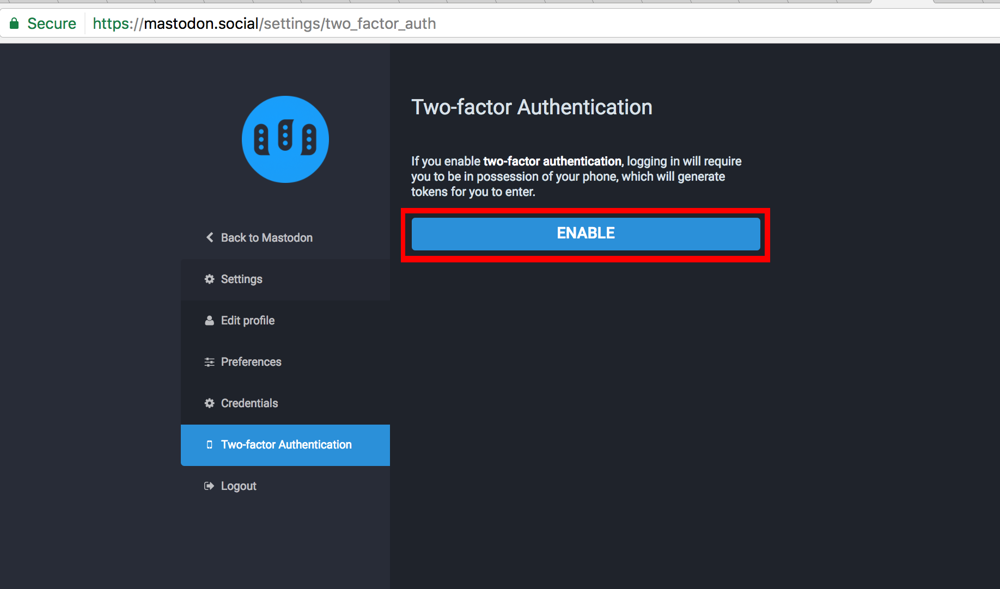
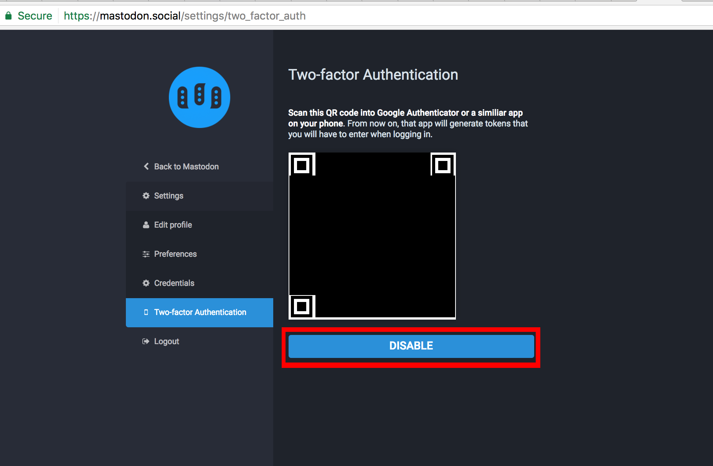

# 2-Factor Authentication

2-Factor Authentication is a security mechanism that requires you to enter a computer generated code from your phone every time you log into Mastodon.

We highly recommend that you set up 2-factor authentication as it prevents malicious users from logging into your account if they obtain your password.

## Warning

If you lose access to your 2-factor authentication (such as by losing your phone or performing a factory reset) and you do cannot log in, you will not be able to access your account and will need to contact an instance admin to remove 2-factor authentication from your account.

## Setup

1. Open your [settings page](https://mastodon.social/settings/two_factor_auth) and navigate to the Two-factor Authentication page
2. Press the big blue "Enable" button that appears on the right 
3. Follow instructions below to install an authenticator for your smartphone

## Android

__Recommended Application:__ [Google
Authenticator](https://play.google.com/store/apps/details?id=com.google.android.apps.authenticator2)

4. Download the above application on your phone
5. Open the "Authenticator" app
6. Press the + button in the bottom right-hand corner
7. Press "Scan a barcode"
8. Line up the black and white QR code with the target box that appears on your camera
9. Now, whenever you log in to Mastodon, open the Authenticator app and enter the 6 digit code that appears above the "mastodon.social (email address)" text

## iPhone

__Recommended Application:__ iPhone: [Authenticator by Matt
Ruben](https://itunes.apple.com/us/app/authenticator/id766157276?mt=8)
Authenticator](https://play.google.com/store/apps/details?id=com.google.android.apps.authenticator2)

4. Download the above application on your phone
5. Open the "Authenticator" app
6. Press the + button in the bottom right-hand corner
7. Authenticator should prompt you for access to your camera- hit "OK"
8. Line up the black and white QR code with the target box that appears on your camera
9. Now, whenever you log in to Mastodon, open the Authenticator app and enter the 6 digit code that appears above the "mastodon.social (email address)" text

# Disabling 2-factor Authentication

1. Go to [the 2-factor authentication settings page](https://mastodon.social/settings/two_factor_auth)
2. Press the big blue "Disable" button underneath your QR code 
