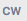
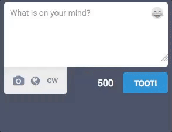
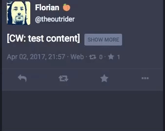
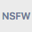
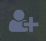
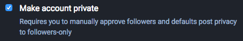
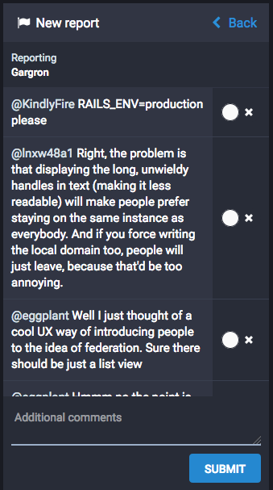

Mastodon User's Guide
=====================

* [Intro](User-guide.md#intro)
  * [Decentralization and Federation](User-guide.md#decentralization-and-federation)
* [Getting Started](User-guide.md#getting-started)
  * [Setting Up Your Profile](User-guide.md#setting-up-your-profile)
  * [E-Mail Notifications](User-guide.md#e-mail-notifications)
  * [Text Posts](User-guide.md#text-posts)
    * [Content Warnings](User-guide.md#content-warnings)
    * [Hashtags](User-guide.md#hashtags)
    * [Boosts and Favourites](User-guide.md#boosts-and-favourites)
  * [Posting Images](User-guide.md#posting-images)
  * [Following Other Users](User-guide.md#following-other-users)
  * [Notifications](User-guide.md#notifications)
  * [Mobile Apps](User-guide.md#mobile-apps)
  * [The Public Timeline](User-guide.md#the-public-timeline)
  * [Searching](User-guide.md#searching)
* [Privacy, Safety and Security](User-guide.md#privacy-safety-and-security)
  * [Two-Factor Authentication](User-guide.md#two-factor-authentication)
  * [Account Privacy](User-guide.md#account-privacy)
  * [Toot Privacy](User-guide.md#toot-privacy)
  * [Blocking](User-guide.md#blocking)
  * [Reporting Toots or Users](User-guide.md#reporting-toots-or-users)

## Intro

Mastodon is a social network application based on the GNU Social protocol. It behaves a lot like other social networks, especially Twitter, with one key difference - it is open-source and anyone can start their own server (also called an "instance"), and users of any instance can interact freely with those of other instances (called "federation"). Thus, it is possible for small communities to set up their own servers to use amongst themselves while also allowing interaction with other communities.

#### Decentralization and Federation

Mastodon is a system decentralized through a concept called "federation" - rather than depending on a single person or organization to run its infrastructure, anyone can download and run the software and run their own server. Federation means different Mastodon servers can interact with each other seamlessly, similar to e.g. e-mail.

As such, anyone can download Mastodon and e.g. run it for a small community of people, but any user registered on that instance can follow and send and read posts from other Mastodon instances (as well as servers running other GNU Social-compatible services). This means that not only is users' data not inherently owned by a company with an interest in selling it to advertisers, but also that if any given server shuts down its users can set up a new one or migrate to another instance, rather than the entire service being lost.

Within each Mastodon instance, usernames just appear as `@username`, similar to other services such as Twitter. Users from other instances appear, and can be searched for and followed, as `@user@servername.ext` - so e.g. `@gargron` on the `mastodon.social` instance can be followed from other instances as `@gargron@mastodon.social`).

Posts from users on external instances are "federated" into the local one, i.e. if `user1@mastodon1` follows `user2@gnusocial2`, any posts `user2@gnusocial2` makes appear in both `user1@mastodon`'s Home feed and the public timeline on the `mastodon1` server. Mastodon server administrators have some control over this and can exclude users' posts from appearing on the public timeline; post privacy settings from users on Mastodon instances also affect this, see below in the [Toot Privacy](User-guide.md#toot-privacy) section.

## Getting Started

#### Setting Up Your Profile

You can customise your Mastodon profile in a number of ways - you can set a custom "display" name, a profile "avatar" picture, a background image for your profile page header, and a short "bio" that summarises you or your account.

 To edit your profile, click the Preferences icon in the Compose column and select "Edit Profile" on the left-hand menu on the Preferences page. Your display name is limited to 30 characters, your bio to 160. Avatars and header pictures can be uploaded as png, gif or jpg images and cannot be larger than 2MB. They will be resized to standard sizes - 120x120 pixels for avatars, 700x335 pixels for header pictures.

#### E-Mail Notifications

 Mastodon can notify you of activity via e-mail if you so choose. To adjust your settings for receiving e-mail notifications, click the Preferences icon in the Compose column and select the "Preferences" page from the left-hand menu. Here you will find a number of checkboxes to enable or disable e-mail notifications for various types of activity.

#### Text Posts

The most basic way to interact with Mastodon is to make a text post, also called a *Toot*. In order to toot, simply enter the message you want to post into the "What is on your mind?" text box in the Compose column and click "TOOT". There is a limit of up to 500 characters per toot; if you really do need more than this you can reply to your own toots so they will appear like a conversation.

If you want to reply to another user's toot, you can click the "Reply" icon on it. This will add their username to your input box along with a preview of the message you're replying to, and the user will receive a notification of your response.

Similarly, in order to start a conversation with another user, just mention their user name in your toot. When you type the @ symbol followed directly (without a space) by any character in a message, Mastodon will automatically start suggesting users that match the username you're typing. Like with replies, mentioning a user like this will send them a notification.

##### Content Warnings

When you want to post something that you don't want to be immediately visible - for example, spoilers for that film that's just out, or some personal thoughts that contain [triggers](http://www.bbc.co.uk/news/blogs-ouch-26295437), you can "hide" it behind a Content Warning.

To do this, click the  "CW" switch under the Compose box. This will add another text box labeled "Content warning"; you should enter a short summary of what the "body" of your post contains here while your actual post goes into the "What is on your mind?" box as normal.

This will cause the body of your post to be hidden behind a "Show More" button in the timeline, with only the content warning visible by default:

**NOTE** that this will not hide images included in your post - images can be marked as "sensitive" separately to hide them from view until clicked on. To find out how to do this, see the [Posting Images](User-guide.md#posting-images) section of this user guide.

##### Hashtags

If you're making a post belonging to a wider subject, it might be worth adding a "hashtag" to it. This can be done simply by adding any alphanumeric term with a # sign in front of it to the toot, e.g. #introductions (which is popular on mastodon.social for new users to introduce themselves to the community), or #politics for political discussions, etc. Clicking on a hashtag in a toot will show a timeline consisting only of toots that include this hashtag (i.e. it's a shortcut to searching for it). This allows users to group messages of similar subjects together, forming a separate "timeline" for people interested in that subject.

##### Boosts and Favourites

You can *favourite* another user's toot by clicking the star icon underneath. This will send the user a notification that you have marked their post as a favourite; the meaning of this varies widely by context from a general "I'm listening" to signalling agreement or offering support for the ideas expressed.

Additionally you can *boost* toots by clicking the "circular arrows" icon. Boosting a toot will show it on your profile timeline and make it appear to all your followers, even if they aren't following the user who made the original post. This is helpful if someone posts a message you think others should see, as it increases the message's reach while keeping the author information intact.

#### Posting Images

 In order to post an image, simply click or tap the "image" icon in your Compose column and select a file to upload.

If the image is "not safe for work" or has otherwise sensitive content, you can select the  "NSFW" button which appears once you have added an image. This will hide the image in your post by default, making it clickable to show the preview. This is the "visual" version of [content warnings](User-guide.md#content-warnings) and could be combined with them if there is text to accompany the image - otherwise it's fine to just mark the image as sensitive and make the body of your post the content warning.

You can also attach video files or GIF animations to Toots. However, there is a 4MB file size limit for these files and videos must be in .webm or .mp4 format.

#### Following Other Users

Following another user will make all of their toots as well as other users' toots which they [boost](User-guide.md#boosts-and-favourites) in your Home column. This gives you a separate timeline from the [public timeline](User-guide.md#the-public-timeline) in which you can read what particular people are up to without the noise of general conversation.

 In order to follow a user, click their name or avatar to open their profile, then click the Follow icon in the top left of their profile view.

If their account is locked (which is shown with a padlock icon  next to their user name), they will receive a notification of your request to follow them and need to approve this before you are added to their follower list (and thus see their toots). To show you that you're waiting for someone to approve your follow request, the Follow icon  on their profile will be replaced with an hourglass icon .

Once you follow a user, the Follow icon will be highlighted in blue on their profile ; you can unfollow them again by clicking this.

If you know someone's user name you can also open their profile for following by entering it in the [Search box](User-guide.md#searching) in the Compose column. This also works for remote users, though depending on whether they are known to your home instance you might have to enter their full name including the domain (e.g. `gargron@mastodon.social`) into the search box before their profile will appear in the suggestions.

Alternately, if you already have a user's profile open in a separate browser tab, most GNU Social-related networks should have a "Follow" or "Subscribe" button on their profile page. This will ask you to enter the full user name to follow **from** (ie. if your account is on mastodon.social you would want to enter this as `myaccount@mastodon.social`)

#### Notifications

When someone follows your account or requests to follow you, mentions your user name (either as an initial message or in response to one of your toots) or boosts or favourites one of your toots, you will receive a notification for this. These will appear as desktop notifications on your computer (if your web browser supports this and you've enabled them) as well as in your "Notifications" column.

 You can filter what kind of notifications you see in the Notifications column by clicking the Notification Settings icon at the top of the column and ticking or un-ticking what you do or don't want to see notifications for.

 If your notifications become cluttered, you can clear the column by clicking the Clear icon at the top of the column; this will wipe its contents.

 You can also disable notifications from people you don't follow or who don't follow you entirely - to do this, click the Preferences icon in the Compose column, select "Preferences" on the left-hand menu and check either of the respective "Block notifications" options.

#### Mobile Apps

There are no official mobile Mastodon apps for iOS or Android at this point. However, there are several third-party apps in development; you can find a list of these [here](Apps.md).

#### The Public Timeline

Mastodon has a "Public" timeline, which is a collection of all public toots made by all local users as well as posts from remote users that are federated (because someone on your instance follows the remote user making the post). This is a good way to meet new people to follow or interact with, but can be overwhelming especially if there's a lot of activity.

 To view the public timeline, click the "Public Timeline" icon in your Compose column or the respective button on the Getting Started panel. To hide the public timeline again, simply click the "Back" link at the top of the public column while you're viewing it.

#### Searching

Mastodon has a search function - however, this is limited to users and [hashtags](User-guide.md#hashtags) only and cannot be used to search through the full text of toots. In order to start a search, just type into the search box in the Compose column; Mastodon will automatically start showing suggestions of both user names and hashtags in a pop-up after a moment. Selecting any of these will open the user's profile or a view of all toots on the hashtag.

## Privacy, Safety and Security

Mastodon has a number of advanced security, privacy and safety features over more public networks such as Twitter. Particularly the privacy controls are fairly granular; this section will explain how these features work.

#### Two-Factor Authentication

Two-Factor Authentication (2FA) is a mechanism that improves the security of your Mastodon account by requiring a numeric code from another device (most commonly mobile phones) linked to your Mastodon account when you log in - this means that even if someone gets hold of both your e-mail address and your password, they cannot take over your Mastodon account as they would need a physical device you own to log in.

Mastodon's 2FA uses Google Authenticator (or compatible apps). You can install this for free to your [Android](https://play.google.com/store/apps/details?id=com.google.android.apps.authenticator2) or [iOS](https://itunes.apple.com/gb/app/google-authenticator/id388497605) device; [this Wikipedia page](https://en.wikipedia.org/wiki/Google_Authenticator#Implementations) lists further versions of the app for other systems.

 In order to enable 2FA for your Mastodon account, click the Preferences icon in the Compose column, click "Two-factor Authentication" in the left menu on the settings page and follow the instructions. Once activated, every time you log in you will need a one-time code generated by the Authenticator app on the device you've linked to your account.

#### Account Privacy

To allow you more control over who can see your toots, Mastodon supports "private" or "locked" accounts. If your account is set to private, you will be notified every time someone tries to follow you, and you will be able to allow or deny the follow request. Additionally, if your account is private, any new toots you compose will default to being private (see the [Toot Privacy](User-guide.md#toot-privacy) section below).

 To make your account private, click the Preferences icon in the Compose pane, select "Edit Profile" and tick the "Make account private" checkbox, then click "Save Changes".

#### Toot Privacy

Toot privacy is handled independently of account privacy, and individually for each toot. The three tiers of visibility for toots are Public (default), Unlisted or Private. In order to select your privacy level, click the  globe icon. Changes to this setting are remembered between posts, i.e. if you make one private toot you will need to disable the switch again to make public toots.

**Public** is the default status of toots on accounts not set to private; a toot is public if neither of the two flags are set. Public toots are visible to any other user on the public timeline, federate to other GNU Social instances without restriction and appear on your user profile page to anyone including search engine bots and visitors who aren't logged into a Mastodon account.

**Unlisted** toots are toggled with the "Do not display in public timeline" option in the Compose pane. They are visible to anyone following you and appear on your profile page to the public even without a Mastodon login, but do *not* appear to anyone viewing the Public Timeline while logged into Mastodon.

**Private** toots, finally, are toggled with the "Mark as private" switch. Private toots do not appear in the public timeline nor on your profile page to anyone viewing it unless they are on your Followers list. This means the option is of very limited use if your account is not also set to be private (as anyone can follow you without confirmation and thus see your private toots). However the separation of this means that if you *do* set your entire account to private, you can switch this option off on a toot to make unlisted or even public toots from your otherwise private account.

Private toots do not federate to other instances, unless you @mention a remote user. In this case, they will federate to their instance *and may appear there PUBLICLY*. A warning will be displayed if you're composing a private toot that will federate to another instance.

Private toots cannot be boosted. If someone you follow makes a private toot, it will appear in your timeline with a padlock icon in place of the Boost icon. **NOTE** that remote instances may not respect this.

**Direct** messages are only visible to users you have @mentioned in them. This does *not* federate to protect your privacy (as other instances may ignore the "Direct" status and display the messages as public if they were to receive them), even if you have @mentioned a remote user.

To summarise:

Toot Privacy | Visible on Profile | Visible on Public Timeline | Federates to other instances
------------ | ------------------ | -------------------------- | ---------------------------
Public | Anyone incl. anonymous viewers | Yes | Yes
Unlisted | Anyone incl. anonymous viewers | No | Yes
Private | Followers only | No | Only remote @mentions
Direct | No | No | No

#### Blocking

You can block a user to stop them contacting you. To do this, you can click or tap the Menu icon on either a toot of theirs or their profile view and select "Block".

**NOTE** that this will stop them from seeing your public toots while they are logged in, but they *will* be able to see your public toots by simply opening your profile in another browser that isn't logged into Mastodon (or logged into a different account that you have not blocked).

Mentions, favourites, boosts or any other interaction with you from a blocked user will be hidden from your view. You will not see replies to a blocked person, even if the reply mentions you, nor will you see their toots if someone boosts them. You will not see toots mentioning a blocked person except in the public timeline.

The blocked user will not be notified of your blocking them. They will be removed from your followers, *but* will still be able to see any public toots you make. Blocks do not federate across instances.

#### Reporting Toots or Users

If you encounter a toot or a user that is breaking the rules of your instance or that you otherwise want to draw the instance administrators' attention to (e.g. if someone is harassing another user, spamming pornography or posting illegal content), you can click the "..." menu button on the toot or the "hamburger" menu on the profile and select to report this. The rightmost column will then switch over to the following form:

In this form, you can select any toots you would like to report to the instance administrators and fill in any comment that might be helpful in identifying or handling the issue (from "is a spammer" to "this post contains untagged pornography"). The report will be visible to server administrators once it is sent so they can take appropriate action, for example hiding the user's posts from the public timeline or banning their account.
