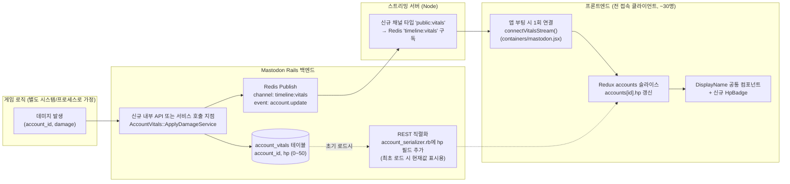
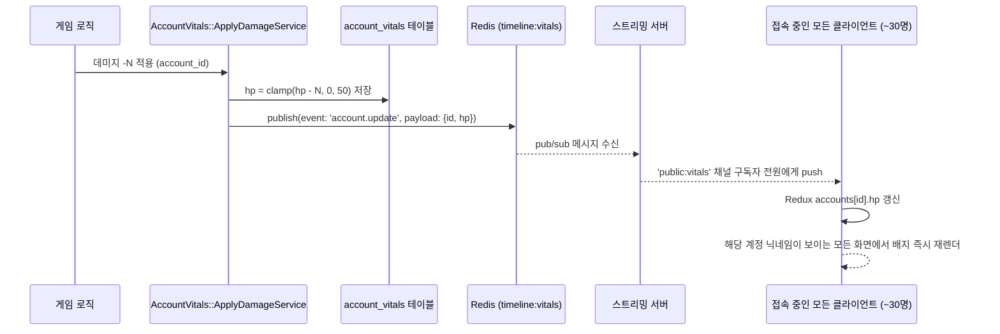

# 닉네임 옆 실시간 체력바(HP Badge) 구현 계획

## 1. 확정된 요구사항

| 항목 | 내용 |
|---|---|
| 표시 형태 | 붉은 하트 모양 안에 숫자 (0~50) — 예: `❤️27` |
| 표시 위치 | 닉네임이 노출되는 **모든 곳** (타임라인, 알림, 검색결과, 호버카드, 계정 목록 등) |
| 초기값 | 50 |
| 갱신 주체 | **게임 로직**이 데미지 발생 시 값을 감소시킴 (Mastodon 자체 로직이 아님) |
| 갱신 반영 속도 | 진짜 실시간 (수 초 이내), 새로고침 불필요 |
| 운영 환경 | 이 기능을 쓰는 **독립적인 Mastodon 서버 1개** (다른 인스턴스와 연합되지 않은 소규모 전용 서버로 가정) |
| 동시 조회자 규모 | **약 30명 내외** |

## 2. 핵심 설계 인사이트: 규모가 아키텍처를 크게 단순화한다

이전 검토에서 "닉네임 나오는 모든 곳 + 즉시 반영"의 가장 큰 리스크는 **"화면에 지금 이 계정 이름을 띄우고 있는 사람에게만" 실시간으로 쏴주는 것**이 Mastodon 스트리밍 구조상 없다는 점이었습니다 (스트리밍은 타임라인/리스트/해시태그/내 알림 단위 구독만 지원).

하지만 이번 조건(**독립 서버 + 동시 접속 약 30명**)에서는 이 문제를 다음과 같이 단순화할 수 있습니다.

> **"이 계정 화면에 보이는 사람에게만" 선별적으로 보내는 정교한 방식 대신, "접속 중인 모든 클라이언트에게 HP 변경 이벤트를 그냥 다 뿌리고, 프론트엔드가 자기 화면에 그 계정이 떠 있으면 알아서 반영"하는 단순 브로드캐스트 방식으로 충분합니다.**

30명 규모에서는 이벤트를 전원에게 방송해도 트래픽/성능 문제가 전혀 없고, 오히려 "화면에 보이는 계정만 골라 구독/해제하는" 복잡한 로직(스크롤 시 IntersectionObserver로 구독 열고 닫기 등)을 만들 필요가 없어져 구현 리스크가 크게 줄어듭니다.

또한 코드를 직접 확인한 결과, Mastodon 프론트엔드는 앱이 처음 로드될 때 **`user` 스트림을 한 번만 연결하고 이후 페이지 이동과 무관하게 계속 유지**합니다 (`app/javascript/mastodon/containers/mastodon.jsx:34`, `componentDidMount`에서 `connectUserStream()` 1회 dispatch). 즉, "앱을 켜놓은 동안에는 어느 화면에 있든 항상 연결되어 있는 채널"이 이미 존재하는 패턴이므로, 같은 방식으로 **새 브로드캐스트 채널을 앱 부팅 시 1회만 추가로 연결**하면 "모든 화면에서 즉시 반영" 요구사항을 그대로 만족시킬 수 있습니다.

(참고: 서버의 기존 "system 채널"(`timeline:system:<accountId>`)은 매 연결마다 자동 구독되긴 하지만, 현재 구현상 `kill`/`filters_changed` 이벤트를 프론트로 전달하지 않고 서버 내부에서만 소비하는 용도라 재사용이 불가능함을 확인했습니다 — 그래서 기존 채널을 억지로 재사용하기보다 `public`류와 동일한 성격의 **새 채널 타입**을 하나 추가하는 것이 더 깔끔합니다.)

## 3. 전체 아키텍처



## 4. 처리 흐름 (시퀀스)



## 5. 백엔드 변경 사항

### 5-1. DB 스키마 (신규 테이블, `account_stats`와 동일한 관례)
```ruby
# db/migrate/XXXXXXXXXXXXXX_create_account_vitals.rb
create_table :account_vitals do |t|
  t.references :account, null: false, foreign_key: true, index: { unique: true }
  t.integer :hp, null: false, default: 50
  t.timestamps
end
```
- `app/models/account_vital.rb` — `belongs_to :account, inverse_of: :account_vital`, `validates :hp, numericality: { in: 0..50 }`.
- `app/models/account.rb`에 `has_one :account_vital` 연관관계 추가 (기존 `has_one :account_stat` 패턴과 동일).
- 기존 `accounts` 테이블(이미 40개 이상 컬럼)에 직접 컬럼을 추가하지 않고 별도 테이블로 분리 — 자주 바뀌는 값을 넓은 핵심 테이블에서 분리하는 기존 관례(`account_stats`)를 그대로 따름.

### 5-2. 값 갱신 + 이벤트 발행
- `app/services/account_vitals/apply_damage_service.rb` (신규): `call(account, amount)` → `hp`를 0~50 사이로 clamp하여 저장 → Redis에 `event: 'account.update'` 발행.
- 발행 채널: 기존 `PushUpdateWorker` 등이 쓰는 `redis.publish(channel, payload)` 패턴 재사용, 채널명은 계정별이 아닌 **고정된 단일 채널**(예: `timeline:vitals`)로 통일 — 30명 규모이므로 "누가 이 계정을 보고 있는지" 구분할 필요가 없음.

### 5-3. 게임 로직과의 연동 지점 (확정됨 → [`game-keyword-dice-attack-plan.md`](./game-keyword-dice-attack-plan.md) 참고)
게임 로직은 "사용자가 봇 계정에 멘션/답글로 키워드를 보내면, Google Sheet를 조회해 구문+다이스를 출력하고 발신자의 HP를 깎는" 방식으로 확정되었으며, **같은 Rails 프로세스 내부(Sidekiq 워커)에서 동작**합니다.
- 내부 전용 API는 불필요 — `app/workers/local_notification_worker.rb`에 훅을 추가해 게임 봇 계정에 대한 멘션 알림 발생 시 `Game::ProcessKeywordCommandWorker`를 enqueue하고, 이 워커가 `AccountVitals::ApplyDamageService.call(sender, dice)`를 **직접 호출**합니다.
- 데미지 대상(=발신자) 식별은 `notification.from_account`로 모호함 없이 확정 (자세한 내용은 별도 문서 참고).

### 5-4. REST 직렬화 (최초 페이지 로드 시 현재값 표시)
- `app/serializers/rest/account_serializer.rb`에 `hp` 필드 추가 (기존 `followers_count` 등과 동일한 방식으로 `object.account_vital&.hp` 노출).
- 스트리밍 이벤트가 오기 전, 페이지를 처음 열었을 때도 현재 체력이 정확히 보이도록 보장.

## 6. 스트리밍 서버(Node) 변경 사항

- `streaming/index.js`
  - `channelNameFromPath` / `channelNameToIds`에 신규 채널 타입 추가: 예 `public:vitals` → 고정 Redis 채널 `timeline:vitals` 매핑 (계정별 분기 없음, 인증 스코프는 기존 `public`류와 동일하게 `read` 정도로 완화 가능 — 민감 정보 아님).
  - 기존 `subscribeWebsocketToChannel` 로직을 그대로 타므로 신규 코드는 "채널 이름 → 채널 ID 매핑 규칙 한 줄 추가" 수준으로 작음.

## 7. 프론트엔드 변경 사항

- `app/javascript/mastodon/actions/streaming.js` — 신규 `connectVitalsStream()` 추가 (`connectTimelineStream('vitals', 'public:vitals', ...)` 패턴), `onReceive`에서 `event === 'account.update'`일 때 새 액션(`updateAccountVital` 등) dispatch.
- `app/javascript/mastodon/containers/mastodon.jsx` — `componentDidMount`에서 `connectUserStream()` 바로 옆에 `connectVitalsStream()`도 함께 dispatch (앱 부팅 시 1회, 로그인 여부와 무관하게 연결 — 비로그인 방문자도 배지를 봐야 하면 인증 없이 구독 가능하도록 서버 쪽 스코프 완화 필요).
- `app/javascript/mastodon/models/account.ts` — `AccountShape`/`accountDefaultValues`/`AccountFieldShape`와 별개로 최상위에 `hp: number` 필드 추가, `ApiAccountJSON` 타입(`app/javascript/mastodon/api_types/accounts.ts`)에도 `hp` 추가.
- 신규 리듀서 처리: 스트림에서 받은 `account.update` 이벤트를 기존 정규화된 `accounts` 스토어의 해당 계정 엔트리에 `hp`만 patch (전체 계정 재조회 없이 가벼운 merge).
- **배지 컴포넌트** (신규): `app/javascript/mastodon/components/badge/index.tsx`의 기존 `Badge`/`FollowsYouBadge` 패턴을 그대로 본떠 `HpBadge` 작성 (하트 아이콘 + 숫자).
- **삽입 위치**: 조사 결과 닉네임 렌더링은 `app/javascript/mastodon/components/display_name/` 계열 공통 컴포넌트로 거의 전부 통합되어 있으므로, 개별 ~45개 호출 지점을 각각 수정할 필요 없이 **`display_name` 내부 한 곳에 `HpBadge`를 삽입**하면 타임라인/알림/검색결과/호버카드/계정 목록 등 전체에 자동 반영됨.
- 성능 참고: `account.update` 이벤트가 오면 Redux `accounts` 정규화 스토어의 해당 엔트리만 갱신되므로, 실제로 화면에 그 계정이 렌더링 중인 컴포넌트만 리렌더됨 (React/Redux의 일반적인 선택적 리렌더링 — 별도 최적화 불필요, 30명 규모에서는 신경 쓸 이슈 아님).

## 8. 구현 단계

1. DB 마이그레이션 + `AccountVital` 모델 + `Account#account_vital` 연관관계.
2. `AccountVitals::ApplyDamageService` 작성 (clamp 로직 + Redis publish).
3. 게임 로직 연동 지점 확정 후, 내부 API 엔드포인트(또는 직접 서비스 호출) 연결.
4. `account_serializer.rb`에 `hp` 필드 추가.
5. `streaming/index.js`에 `public:vitals` 채널 타입 추가.
6. 프론트: `connectVitalsStream()` 추가 + `containers/mastodon.jsx`에서 부팅 시 연결.
7. 프론트: `AccountShape`/`ApiAccountJSON`에 `hp` 추가, `account.update` 스트림 이벤트 → Redux merge 액션/리듀서 작성.
8. `HpBadge` 컴포넌트 작성 (`Badge` 패턴 재사용) + `display_name` 공통 컴포넌트에 삽입.
9. 테스트
   - 서비스 단위 테스트: 데미지 적용 시 0 미만/50 초과로 넘어가지 않는지 (clamp 검증).
   - 스트리밍 통합 테스트: HP 갱신 → 다른 클라이언트가 실시간으로 값 반영받는지.
   - 프론트 컴포넌트 테스트: `HpBadge`가 0/25/50 등 값에 따라 올바르게 렌더되는지.
10. 실제 서버에 배포 후, 여러 브라우저 탭/계정으로 동시 접속해 실시간 반영 수동 검증 (30명 규모 시뮬레이션은 필요 없고, 2~3개 탭으로 충분히 검증 가능).

## 9. 남은 확인 사항 / 가정

- **비로그인 사용자에게도 배지가 보여야 하는지** — 만약 그렇다면 `connectVitalsStream()`을 인증 없이도 열 수 있도록 서버 채널 인증 정책을 확인해야 함 (현재 계획은 로그인 사용자 기준으로 작성, 이 서버가 "독립적인 서버"이고 참여자가 정해진 ~30명이라는 점을 고려하면 전원 로그인 사용자일 가능성이 높다고 가정).
- **HP가 0이 될 때의 후속 동작** (예: 상태 변화, 알림, 리스폰 등)은 이번 계획 범위 밖 — 순수하게 "값 표시 + 실시간 반영"만 다룸.
- 이 설계는 "독립 서버 + 동시 접속 ~30명" 전제 위에 최적화되어 있습니다. 향후 이 기능을 대규모 공개 인스턴스로 확장한다면, 전원 브로드캐스트 방식은 재검토가 필요합니다 (이전 검토에서 언급한 "화면에 보이는 계정만 동적 구독" 방식으로 재설계 필요).

## 10. Mastodon 코드베이스 영향 범위 요약

| 구분 | 파일 | 변경 유형 |
|---|---|---|
| DB | `db/migrate/xxxx_create_account_vitals.rb` | 신규 |
| 모델 | `app/models/account_vital.rb` | 신규 |
| 모델 | `app/models/account.rb` | `has_one :account_vital` 추가 |
| 서비스 | `app/services/account_vitals/apply_damage_service.rb` | 신규 |
| 게임 로직 훅 | `app/workers/local_notification_worker.rb` 외 [`game-keyword-dice-attack-plan.md`](./game-keyword-dice-attack-plan.md) 참고 | 신규 (별도 문서) |
| 직렬화 | `app/serializers/rest/account_serializer.rb` | `hp` 필드 추가 |
| 스트리밍 서버 | `streaming/index.js` | `public:vitals` 채널 타입 추가 |
| 프론트 액션 | `app/javascript/mastodon/actions/streaming.js` | `connectVitalsStream()` 추가 |
| 프론트 부팅 | `app/javascript/mastodon/containers/mastodon.jsx` | 부팅 시 스트림 연결 추가 |
| 프론트 타입/모델 | `app/javascript/mastodon/api_types/accounts.ts`, `app/javascript/mastodon/models/account.ts` | `hp` 필드 추가 |
| 프론트 배지 | `app/javascript/mastodon/components/badge/index.tsx` | `HpBadge` 추가 |
| 프론트 삽입 위치 | `app/javascript/mastodon/components/display_name/*.tsx` | `HpBadge` 렌더 삽입 |
