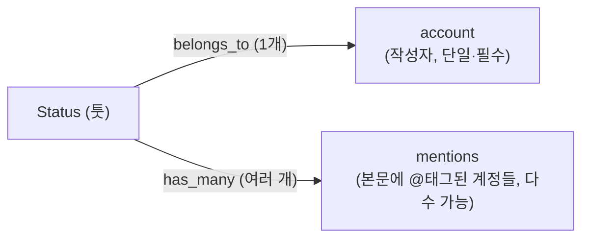
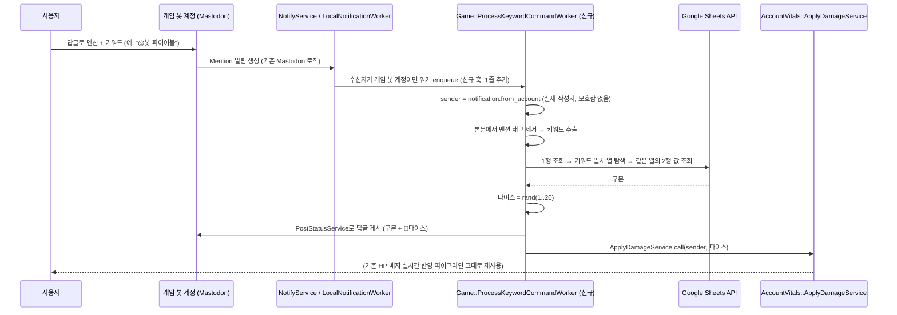

# 키워드-다이스 공격 게임 로직 구현 계획

이 문서는 [`account-hp-badge-realtime-plan.md`](./account-hp-badge-realtime-plan.md)에서 "게임 로직"으로 미뤄뒀던 부분,
즉 실제로 HP를 깎는 트리거인 "키워드 입력 → 구문+다이스 출력 → 데미지 반영" 로직을 다룬다.

## 1. 확정된 요구사항

| 항목 | 내용 |
|---|---|
| 입력 경로 | 사용자가 게임 봇 계정에 **멘션/답글**로 키워드를 보냄 |
| 조회 대상 | Google Sheet의 특정 시트(탭): **1행 = 키워드 목록(열마다 하나씩)**, **2행 = 그 키워드에 대응하는 구문** |
| 매칭 로직 | 1행에서 사용자가 입력한 키워드와 일치하는 **열**을 찾음 → 같은 열의 2행 값을 가져옴 |
| 출력 | 해당 구문 + 랜덤 다이스 숫자(1~20)를 답글로 게시 |
| 데미지 반영 대상 | **명령을 보낸 사용자 자신** (= 그 툿의 작성자) |
| 데미지 반영 방식 | 다이스 숫자만큼 [[account-hp-badge-realtime-plan]]의 `account_vitals.hp`에서 마이너스 |
| 매칭 실패 시 응답 | 고정 문구 **"키워드를 확인해주세요. 문제가 지속되면 관리인을 호출하세요"** 답글, 데미지 없음 |
| 어뷰징 방지 | 쿨다운 없음 (제한 없이 반복 명령 허용) |
| 매칭 규칙 | **완전 일치** — 멘션 제거 후 트리밍/공백 정규화·대소문자 무시한 문자열이 1행 키워드와 정확히 같아야 함 (부분 포함 불가) |

## 2. 핵심 기술 판단: "발신자 식별" 문제는 이미 해결되어 있음

우려하셨던 부분 — "답글에 여러 계정이 태그될 수 있는데, 그중 진짜 명령을 보낸 사람을 어떻게 구분하는가" — 은 별도 로직이 필요 없습니다.



- `app/models/status.rb`: `belongs_to :account` (작성자, 단일) 와 `has_many :mentions` (본문에 태그된 계정들, 다수)는 **완전히 분리된 필드**입니다. 답글에는 스레드 참여자 전원이 `mentions`에 자동으로 포함되지만, 그건 "누가 이 툿을 썼는가"와 무관합니다.
- `app/models/notification.rb:250`: 멘션 알림이 생성될 때 `from_account_id`는 `activity.status.account_id`로 **명시적으로 설정**됩니다. 즉 `notification.from_account`는 항상 정확히 "이 알림을 유발한 툿을 실제로 쓴 사람"입니다.
- **결론**: "가장 먼저 태그된 계정" 같은 순서 기반 추정은 필요 없고, 오히려 신뢰할 수 없는 방식입니다(멘션 배열의 순서는 의미가 보장되지 않음). `notification.from_account` (또는 `notification.target_status.account`) 하나만 보면 됩니다.

## 3. 전체 흐름



## 4. 시트 구조 (예시)

```
      A(파이어볼)          B(아이스볼)          C(강타)
1행   파이어볼             아이스볼             강타
2행   화염구가 작렬했다!    얼음창이 꽂혔다!      묵직한 일격이 들어갔다!
```
- 1행: 각 열에 키워드 하나씩 (검색 대상)
- 2행: 같은 열에 대응하는 출력 구문
- 매칭 실패(1행에 없는 키워드) 시: 고정 문구 "키워드를 확인해주세요. 문제가 지속되면 관리인을 호출하세요"로 답글, 데미지 없음
- 매칭 규칙: **완전 일치**. 예를 들어 1행에 `파이어볼`이 등록되어 있어도 사용자가 `파이어볼 시전`처럼 앞뒤에 다른 말을 덧붙이면 매칭 실패로 처리됨 (자세한 정규화 규칙은 5-2 참고)

## 5. 백엔드 설계

### 5-1. 훅 지점 (신규 vs 기존 코드 최소 수정)
- 기존 `app/workers/local_notification_worker.rb` (알림 생성을 실제로 수행하는 Sidekiq 워커)에 **한 줄만 추가**: 알림의 수신자(`receiver`)가 게임 봇 계정이고 타입이 `mention`이면 `Game::ProcessKeywordCommandWorker.perform_async(notification.id)`를 enqueue.
- 이 방식을 선택한 이유: `Mention`/`Notification` 모델 자체에는 `after_create` 콜백이 없고, 알림 생성은 `FanOutOnWriteService → LocalNotificationWorker → NotifyService`로 명령형으로 흘러가는 구조이기 때문에, 기존 콜백 체계를 새로 만들기보다 이미 있는 워커 진입점에 조건부 분기를 추가하는 것이 가장 침습적이지 않음.
- 게임 로직 자체(`Game::*`)는 별도 네임스페이스/파일로 완전히 분리 — 핵심 알림 처리 로직을 오염시키지 않음.

### 5-2. `Game::ProcessKeywordCommandWorker` (신규)
1. `notification = Notification.find(id)`
2. `sender = notification.from_account` — 데미지를 받을 대상 (모호함 없음, 2번 섹션 참고)
3. `status = notification.target_status` — 툿 본문
4. 본문에서 멘션 태그를 제거한 나머지 텍스트를 키워드 후보로 추출한 뒤, 다음 순서로 정규화:
   1. 앞뒤 공백/개행 제거(trim)
   2. 연속 공백을 단일 공백으로 축소
   3. 대소문자 구분 없이 비교 (영문 키워드 대비 `downcase` 등)
5. `Game::KeywordLookupService.call(normalized_keyword)` 호출 → 1행의 키워드 목록과 **완전 일치**하는 열만 인정(부분 문자열 포함/접두·접미 매칭 불가) → 구문 반환 (없으면 `nil`)
6. **매칭 실패** (`phrase.nil?`): `PostStatusService.new.call(bot_account, text: "키워드를 확인해주세요. 문제가 지속되면 관리인을 호출하세요", thread: status)`만 게시하고 종료. 다이스/데미지 처리 없음.
7. **매칭 성공**: `dice = rand(1..20)`
8. `PostStatusService.new.call(bot_account, text: "#{phrase} (🎲#{dice})", thread: status)` — REST API 왕복 없이 **같은 프로세스 내에서 직접 호출** (봇 계정이 로컬 계정이므로 토큰 발급/HTTP 호출 불필요)
9. `AccountVitals::ApplyDamageService.call(sender, dice)` — [[account-hp-badge-realtime-plan]]의 기존 서비스 재사용, 이 호출만으로 HP 배지 실시간 갱신 파이프라인이 그대로 동작함 (추가 연동 불필요)
10. 쿨다운/레이트리밋 없음 — 동일 사용자가 연속으로 멘션을 보내도 매번 그대로 처리 (확정됨, 아래 8번 참고)

### 5-3. `Game::KeywordLookupService` (신규)
- Google Sheets API v4 `spreadsheets.values.get`으로 해당 탭의 1~2행을 한 번에 조회 (`range: "SHEET명!1:2"`).
- 하우스 스타일에 맞춰 신규 HTTP 클라이언트를 만들지 않고, 기존 `app/lib/request.rb`의 `Request` 래퍼(`http` gem 기반, `app/services/fetch_link_card_service.rb` 등에서 쓰는 것과 동일한 패턴)를 재사용.
- 1행 배열에서 키워드와 일치하는 인덱스를 찾고, 2행의 같은 인덱스 값을 반환.
- **캐싱 권장**: 스펠 테이블(1~2행)은 자주 바뀌지 않으므로 Rails 캐시(Redis)에 수 분(예: 5분) TTL로 캐싱해, 멘션마다 Google API를 호출하지 않도록 최적화.

## 6. 구현 단계

1. `Game::KeywordLookupService` 작성 + 단위 테스트 (목업 응답으로 매칭/미매칭 케이스 검증).
2. `Game::ProcessKeywordCommandWorker` 작성 (5-2 로직) + 단위 테스트.
3. `app/workers/local_notification_worker.rb`에 조건부 enqueue 한 줄 추가.
4. Google Sheets 인증 설정 (8번 참고 — 서비스 계정 권장) + credentials 안전 저장.
5. `AccountVitals::ApplyDamageService` (HP 문서에서 이미 계획된 서비스)와 연동 테스트 — 실제로 멘션 → 답글 게시 → HP 배지 실시간 갱신까지 엔드투엔드 확인.
6. 매칭 실패 경로 테스트: 미등록 키워드 입력 시 고정 안내 문구만 게시되고 HP는 변화 없는지 확인.
7. 실제 봇 계정으로 스테이징에서 수동 테스트 (다양한 키워드/오탈자/미등록 키워드, 연속 멘션 케이스 포함).

## 7. Mastodon 코드베이스 영향 범위

| 구분 | 파일 | 변경 유형 |
|---|---|---|
| 훅 | `app/workers/local_notification_worker.rb` | 조건부 enqueue 1줄 추가 |
| 워커 | `app/workers/game/process_keyword_command_worker.rb` | 신규 |
| 서비스 | `app/services/game/keyword_lookup_service.rb` | 신규 |
| 서비스 재사용 | `app/services/post_status_service.rb` | 기존 그대로 호출만 |
| 서비스 재사용 | `app/services/account_vitals/apply_damage_service.rb` | 기존(HP 문서에서 계획) 그대로 호출만 |
| HTTP 클라이언트 | `app/lib/request.rb` | 기존 그대로 재사용 |

## 8. 남은 확인 사항 / 가정

- **Google 인증 방식**: 이 통합은 (이전 "예약 툿" 기능과 달리) **Rails 앱 내부에서 무인 실행**되므로, 사람이 매번 동의하는 OAuth 사용자 인증보다 **서비스 계정(Service Account) 인증**을 권장합니다 (refresh token 만료/재동의 이슈 없이 서버가 상시 조회 가능). 대상 시트를 서비스 계정 이메일에 공유해두면 됨.
- **키워드 매칭 실패 시 동작**: ✅ 확정 — 고정 문구 "키워드를 확인해주세요. 문제가 지속되면 관리인을 호출하세요"로 답글, 데미지 없음.
- **어뷰징/도배 방지**: ✅ 확정 — 쿨다운 없음. 30명 규모 게임이라는 전제하에 반복 명령에 대한 별도 제한을 두지 않음. (인스턴스 규모가 커지거나 악용 사례가 생기면 재검토 필요)
- **키워드 매칭 규칙**: ✅ 확정 — 완전 일치. 멘션 제거 → trim → 연속 공백 축소 → 대소문자 무시 정규화까지만 적용하고, 그 결과가 1행 키워드와 정확히 같아야 매칭 성공으로 처리 (부분 포함/접두·접미 매칭 없음). 자세한 정규화 순서는 5-2 참고.
- **HP가 0 이하로 내려갈 때의 처리**: 0에서 클램프(더 안 깎임)로 가정, 그 이후 게임 오버 등 후속 동작은 이번 계획 범위 밖 (이전 문서와 동일한 전제).

## 9. 이전 문서 업데이트 반영

[`account-hp-badge-realtime-plan.md`](./account-hp-badge-realtime-plan.md)의 5-3 섹션에서 "★ 확인 필요한 가정"으로 남겨뒀던
"게임 로직이 같은 Rails 프로세스 내부인지, 외부 시스템인지"는 이번 문서로 **"같은 Rails 프로세스 내부 (Sidekiq 워커)"로 확정**되었습니다.
따라서 해당 문서의 내부 전용 API 엔드포인트 방안은 불필요하며, `Game::ProcessKeywordCommandWorker`가 `AccountVitals::ApplyDamageService`를 직접 호출하는 것으로 대체됩니다.
