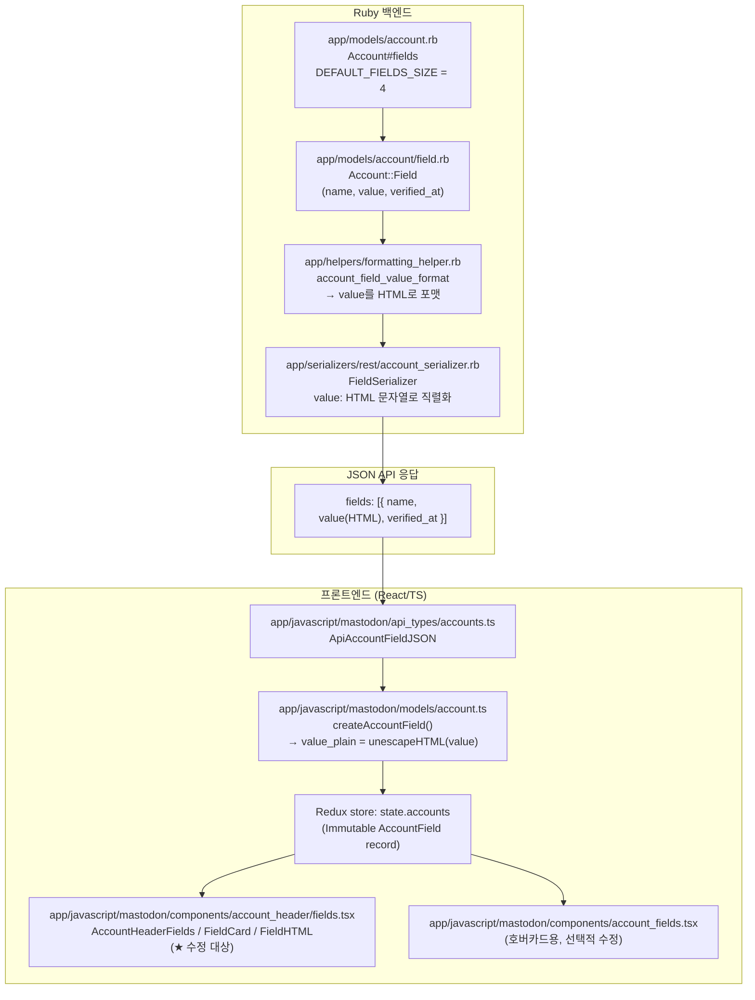
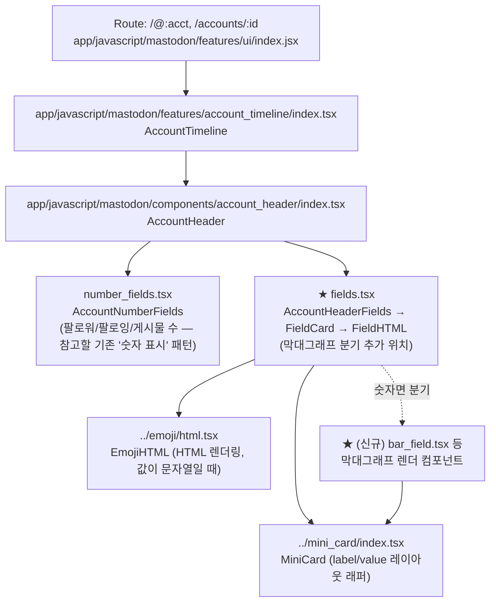
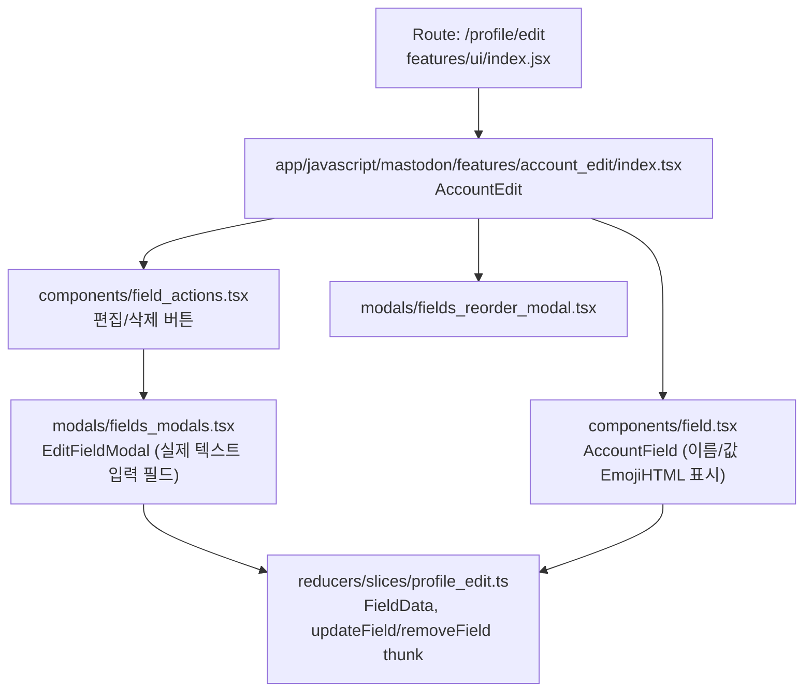

# 프로필 커스텀 필드 → 숫자 값 막대그래프 표시 계획

## 1. 배경

Mastodon 프로필의 "커스텀 필드"(Custom fields, 예: `Pronouns: he/him`)는 이름/값 쌍으로 구성되며,
현재는 값(`value`)이 항상 문자열로 취급되어 HTML로 렌더링된다 (이모지 단축코드, 링크 등을 포함할 수 있기 때문).
숫자만 입력된 값(예: `42`, `85%`)의 경우 이를 감지하여 막대그래프(bar) UI로 표시하는 기능을 추가한다.

**핵심 결론: 서버(Ruby) 변경 없이 프론트엔드(React)만으로 구현 가능하다.**
`value`는 백엔드부터 프론트 Redux 저장소까지 일관되게 `string` 타입이며, 숫자 여부는 클라이언트에서
`value_plain`(순수 텍스트, HTML 언이스케이프된 버전)을 검사해 판별하면 된다.

---

## 2. 파일 구조 다이어그램

### 2-1. 데이터 흐름 (백엔드 → 프론트 표시까지)

### 2-2. 읽기 전용 프로필 화면 컴포넌트 계층 (수정 핵심 위치)

### 2-3. 프로필 편집 화면 (입력 UI, 선택적 수정)

### 2-4. 관련 파일 한눈에 보기

| 영역 | 경로 | 역할 |
|---|---|---|
| 백엔드 모델 | `app/models/account.rb` | `fields` jsonb 컬럼, 최대 4개 |
| 백엔드 모델 | `app/models/account/field.rb` | 단일 필드 객체 (name/value/verified_at) |
| 백엔드 포맷팅 | `app/helpers/formatting_helper.rb` | `account_field_value_format` — value HTML 변환 |
| 백엔드 직렬화 | `app/serializers/rest/account_serializer.rb` | `FieldSerializer` — API 응답 형태 정의 |
| 프론트 타입 | `app/javascript/mastodon/api_types/accounts.ts` | `ApiAccountFieldJSON` |
| 프론트 모델 | `app/javascript/mastodon/models/account.ts` | `AccountFieldShape`, `createAccountField` (`value_plain` 생성) |
| **프론트 표시 (핵심)** | `app/javascript/mastodon/components/account_header/fields.tsx` | `AccountHeaderFields`/`FieldCard`/`FieldHTML` — 프로필 탭 메인 필드 렌더링 |
| 프론트 표시 (호버카드) | `app/javascript/mastodon/components/account_fields.tsx` | 호버카드 내 필드 렌더링 (동일 패턴) |
| 프론트 레이아웃 | `app/javascript/mastodon/components/mini_card/index.tsx` | label/value 카드 래퍼 |
| 참고 패턴 | `app/javascript/mastodon/components/account_header/number_fields.tsx`, `components/number_fields.tsx` | 기존 "숫자 통계" 표시 UI (팔로워 수 등) — 스타일 참고용 |
| 프론트 편집 UI | `app/javascript/mastodon/features/account_edit/components/field.tsx` | 편집 화면에서의 필드 표시 |
| 프론트 편집 모달 | `app/javascript/mastodon/features/account_edit/modals/fields_modals.tsx` | 실제 입력 폼 |
| 스타일 | `app/javascript/mastodon/components/account_header/styles.module.scss` | `fieldList`, `fieldItem`, `fieldVerified` 등 클래스 |

---

## 3. 기능 계획: 숫자 값 → 막대그래프 표시

### 3-1. 요구사항 정리
- 프로필 탭(읽기 전용 화면)에서 커스텀 필드의 값이 **순수 숫자**(정수/소수, 선택적으로 `%` 접미사)일 경우
  텍스트 대신 막대그래프로 표시한다.
- 편집 화면(`account_edit`)은 그대로 텍스트 입력 유지 (입력 방식은 변경하지 않음).
- 값이 숫자가 아니면 기존과 동일하게 HTML 텍스트로 렌더링.

### 3-2. 미해결 사항 (사용자 확인 필요)
- 막대그래프의 **최대값 기준**을 어떻게 정할지: 고정값(예: 0~100), 필드별 최댓값 자동 감지, 아니면 숫자 뒤에 `/100`처럼 사용자가 직접 분모를 입력하게 할지.
- 값 형식 예시: `"85"`, `"85%"`, `"8.5/10"` 등 어떤 패턴까지 지원할지.
- 다크/라이트 테마 색상 및 접근성(스크린리더용 텍스트) 처리 방식.

### 3-3. 구현 단계 (프론트엔드 전용)

1. **숫자 감지 유틸 추가**
   - 새 파일: `app/javascript/mastodon/components/account_header/parse_numeric_field.ts` (가칭)
   - `field.value_plain`을 정규식으로 검사해 숫자/퍼센트 여부와 파싱된 값을 반환하는 순수 함수 작성.
   - 단위 테스트 추가 (`*.test.ts`).

2. **막대그래프 컴포넌트 추가**
   - 새 파일: `app/javascript/mastodon/components/account_header/field_bar.tsx` (가칭)
   - `dataviz` 스타일 가이드에 따라 접근 가능한 색상/마크업으로 단순 진행률 막대 구현 (`<meter>` 또는 `div` + `aria-valuenow` 등).

3. **`fields.tsx`의 `FieldCard`/`FieldHTML` 분기 추가**
   - `app/javascript/mastodon/components/account_header/fields.tsx`의 `FieldCard` (105번째 줄 부근)에서
     `field.value_plain`이 숫자 패턴이면 `value={<FieldBar .../>}`, 아니면 기존 `<FieldHTML .../>`를 렌더링하도록 분기.
   - `MiniCard`의 `value` prop 자리에 그대로 꽂을 수 있어 레이아웃 변경 최소화.

4. **(선택) 호버카드 대응**
   - `app/javascript/mastodon/components/account_fields.tsx`에도 동일 분기 적용할지 결정.
   - 호버카드는 공간이 좁아 막대그래프 대신 기존 텍스트 유지도 검토 가능.

5. **스타일 추가**
   - `app/javascript/mastodon/components/account_header/styles.module.scss`에 막대그래프 관련 클래스 추가.
   - 라이트/다크 테마 모두 대응 (기존 CSS 변수 활용).

6. **국제화(i18n)**
   - 스크린리더용 라벨 등 새 문자열이 필요하면 `app/javascript/mastodon/locales/en.json`에 추가 후 `i18n:extract` 절차 확인.

7. **테스트**
   - 숫자 파싱 유틸 단위 테스트.
   - `fields.tsx` 컴포넌트 테스트(Storybook/RTL)로 숫자/비숫자/퍼센트 케이스 확인.
   - 브라우저에서 실제 프로필 편집 → 프로필 탭 확인 (예: 값 `"77"` 입력 후 프로필 페이지에서 막대그래프 렌더 확인).

### 3-4. 영향 범위 밖 (변경 불필요)
- `app/models/account/field.rb`, `formatting_helper.rb`, `account_serializer.rb` 등 백엔드 — `value`는 여전히 문자열로 저장/직렬화되므로 변경 불필요.
- `features/account_edit/**` 입력 폼 — 텍스트 입력 그대로 유지.
