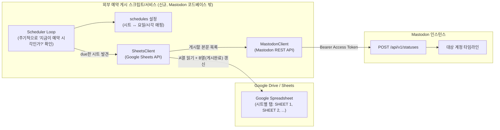
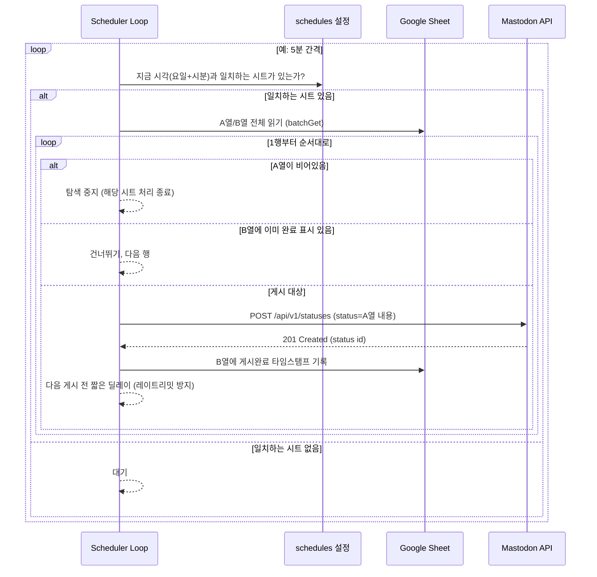

# Google Sheet 연동 예약 툿(TOOT) 게시 - 구현 계획

## 1. 확정된 요구사항 (대화를 통해 확정)

| 항목 | 결정 사항 |
|---|---|
| 실행 위치 | Mastodon 앱 코드베이스와 무관한 **외부 독립 스크립트/서비스** |
| 대상 계정 | 1개의 Mastodon 계정 (Personal Access Token으로 인증) |
| 콘텐츠 출처 | Google Drive의 지정된 Google Sheet |
| 시트 구조 | **A열(단일 열)에 툿 본문이 위에서부터 세로로 나열**. 빈 셀을 만나면 그 시트 탐색을 중지 |
| 예약 단위 | **툿 개별이 아니라 "시트" 단위로 예약 시각을 지정** (예: SHEET 1 = 매주 월요일 오전 9시) |
| 트리거 시 동작 | 지정 시각이 되면 해당 시트를 처음부터 훑어, 아직 게시하지 않은 행을 **순서대로 전부** 툿으로 출력. 빈 행에서 정지 |
| 중복 게시 방지 | 게시한 행은 **삭제하지 않고 "게시완료" 표시만 남김** (다음 주 같은 예약 시각에 재실행되어도 이미 표시된 행은 건너뜀) |
| Google 인증 | OAuth 사용자 인증 (사용자가 최초 1회 동의, 이후 refresh token으로 갱신) |

## 2. 전체 아키텍처



## 3. 시트 데이터 구조 (예시)

| 열 | 내용 | 비고 |
|---|---|---|
| A | 툿 본문 텍스트 | 위에서부터 순서대로 게시 대상. 빈 셀 = 그 시트의 끝 |
| B | 게시완료 표시 | 게시 성공 시 스크립트가 타임스탬프(예: `2026-07-27T09:00:12+09:00`)를 기록. 비어 있으면 "아직 게시 안 됨" |

```
   A                    B (게시완료)
1  첫번째 툿 내용         2026-07-20T09:00:03+09:00   ← 이미 게시됨 → 스킵
2  두번째 툿 내용         2026-07-20T09:00:08+09:00   ← 이미 게시됨 → 스킵
3  세번째 툿 내용         (비어있음)                   ← 아직 게시 안 됨 → 게시 후 B3 기록
4  네번째 툿 내용         (비어있음)                   ← 게시 후 B4 기록
5  (빈 칸)                                            ← 여기서 탐색 중지
```

- **처리 규칙**: 1행부터 순회 → A열이 비어있으면 즉시 중단 → A열에 내용이 있는데 B열도 이미 채워져 있으면 건너뛰고 다음 행으로 → B열이 비어있으면 게시 후 B열에 완료 표시 기록.
- 이렇게 하면 사용자는 시트 하단에 새 줄을 계속 추가하기만 하면 되고, 다음 예약 시각에 새로 추가된 행만 게시됩니다.

## 4. 처리 흐름 (시퀀스)



## 5. 프로젝트(신규 스크립트) 구조 제안

Mastodon Rails 코드베이스를 건드리지 않는 완전히 독립된 프로젝트로 신설합니다.

```
scheduled-toot-bot/                  # 신규 독립 프로젝트 (별도 repo 또는 이 repo의 tools/ 하위)
├── config/
│   ├── schedules.yml                # 시트 ↔ 요일/시각 매핑 설정 (아래 6번 참고)
│   └── credentials/                 # (.gitignore 처리) OAuth 토큰, 서비스 키 등 비밀정보
├── src/
│   ├── main.py                      # 진입점: Scheduler Loop 기동
│   ├── scheduler.py                 # "지금이 due한 시각인가?" 판단 로직
│   ├── sheets_client.py             # Google Sheets API 래퍼 (읽기/쓰기)
│   ├── mastodon_client.py           # Mastodon REST API 래퍼 (POST /api/v1/statuses)
│   ├── sheet_processor.py           # 5번 섹션의 "A열 순회 → 게시 → B열 기록" 핵심 로직
│   └── config_loader.py             # schedules.yml 파싱
├── tests/
│   ├── test_sheet_processor.py
│   └── test_scheduler.py
├── requirements.txt (or pyproject.toml)
└── README.md
```

- **언어/스택 가정**: Python (`google-api-python-client` + `google-auth-oauthlib` + `requests`)로 가정. Google 공식 클라이언트가 성숙하고 스케줄링 라이브러리가 풍부하기 때문. Node.js 등 다른 스택을 원하면 대체 가능.
- Mastodon 쪽은 REST API만 사용하므로 `app/` 이하 Rails 코드는 전혀 수정하지 않습니다 (기존 `POST /api/v1/statuses` + `scheduled_status` 기능은 그대로 두고, 이 스크립트는 순수 API 클라이언트로만 동작).

## 6. 설정 파일 예시 (`config/schedules.yml`)

```yaml
mastodon:
  base_url: "https://example.social"
  access_token_env: "MASTODON_ACCESS_TOKEN"   # 실제 토큰은 환경변수/시크릿에 저장

google:
  spreadsheet_id: "1AbCdEfGhIjKlMnOpQrStUvWxYz"
  oauth_client_secret_path: "config/credentials/google_oauth_client.json"
  token_cache_path: "config/credentials/google_token.json"

sheets:
  - tab_name: "SHEET 1"
    weekday: "monday"
    time: "09:00"
    timezone: "Asia/Seoul"
    content_column: "A"
    status_column: "B"
  - tab_name: "SHEET 2"
    weekday: "wednesday"
    time: "15:00"
    timezone: "Asia/Seoul"
    content_column: "A"
    status_column: "B"

posting:
  delay_between_toots_seconds: 5
  visibility: "public"
```

## 7. 준비 단계 (코드 작성 전 선행 작업)

1. **Mastodon 측**: 대상 계정으로 로그인 → 설정 > 개발 (`/settings/applications`)에서 새 애플리케이션 생성, `write:statuses` 스코프로 액세스 토큰 발급받아 안전하게 보관.
2. **Google 측**: Google Cloud Console에서 프로젝트 생성 → Sheets API 활성화 → OAuth 클라이언트(데스크톱 앱 유형) 생성 → 최초 스크립트 실행 시 브라우저 동의 플로우로 refresh token 발급 및 로컬 안전 저장.
3. 대상 스프레드시트 ID와 탭 이름 확인, 시트 공유 설정에서 인증한 Google 계정에 접근 권한 부여.

## 8. 구현 단계

1. `config_loader.py`: `schedules.yml` 파싱 + 환경변수(토큰 등) 로드.
2. `sheets_client.py`: 지정 스프레드시트/탭의 A·B열 범위를 읽는 함수, 특정 셀(B열)에 값을 쓰는 함수.
3. `mastodon_client.py`: Bearer 토큰으로 `POST /api/v1/statuses` 호출하는 얇은 래퍼. (참고: Mastodon 자체 예약 기능(`scheduled_at`)은 5분 이상 미래 시각만 허용되므로, 이미 예약 시각에 도달해 즉시 게시하는 이 설계에서는 `scheduled_at` 없이 즉시 게시로 호출)
4. `sheet_processor.py`: 3번 섹션의 순회 규칙(빈 A열 → 중지, 이미 게시완료 → 스킵, 그 외 → 게시 후 기록) 구현. 각 게시 사이 `posting.delay_between_toots_seconds` 만큼 대기.
5. `scheduler.py`: 현재 시각(타임존 고려)이 설정된 `weekday` + `time`과 일치하는 시트를 찾는 로직. 정확히 그 "분"에 한 번만 실행되도록 중복 트리거 방지(예: 마지막 처리 시각 기록).
6. `main.py`: 위 컴포넌트를 조립해 주기적으로 (예: 1~5분 간격) 반복 실행하는 루프.
7. **에러 처리**: Mastodon API 실패(네트워크 오류, 레이트리밋 429 등) 시 해당 행은 게시완료 표시를 남기지 않고 중단 → 다음 실행에서 그 행부터 재시도. Google API 실패 시 로깅 후 다음 주기에 재시도.
8. **로깅**: 어떤 시트를 처리했는지, 몇 개 게시했는지, 실패 여부를 파일/콘솔에 기록.
9. **Dry-run 모드**: 실제 게시 없이 "무엇을 게시할지"만 로그로 출력하는 옵션 (테스트/검증용, 강력 권장).
10. **배포**: Windows 환경이므로 Windows 작업 스케줄러(Task Scheduler)에 `main.py`를 상시 실행 프로세스로 등록하거나, 짧은 간격(예: 5분)으로 반복 실행되도록 등록.

## 9. 남은 가정/열린 사항 (기본값 제안, 필요 시 조정 가능)

- **여러 시트-일정 매핑 저장 위치**: 시트 자체가 아니라 스크립트 쪽 `config/schedules.yml`에 하드코딩. (시트 안에 스케줄 설정용 탭을 별도로 두는 방식으로 바꿀 수도 있음)
- **연속 게시 간격**: 한 트리거에서 여러 줄을 게시할 때 5초 간격으로 순차 게시 가정 (레이트리밋/스팸 방지 목적, 조정 가능).
- **가시성/언어 등 툿 옵션**: MVP는 `public`, 언어 미지정으로 가정. 필요하면 시트에 열을 추가해 확장 가능.
- **스크립트 구현 언어**: Python 가정. 다른 언어 선호 시 대체 가능.
- **여러 시트의 물리적 형태**: 하나의 Google Spreadsheet 파일 안의 여러 탭(워크시트)으로 가정 (SHEET 1, SHEET 2 = 탭 이름). 완전히 별도의 스프레드시트 파일들일 경우 `spreadsheet_id`를 시트별로 분리하면 됨.

## 10. Mastodon 코드베이스 영향 범위

**없음.** 이 기능은 REST API(`POST /api/v1/statuses`)만 사용하는 외부 클라이언트이므로 Rails 앱(`app/`, `config/sidekiq.yml` 등)에 대한 수정은 필요하지 않습니다. 대상 계정에서 Personal Access Token만 발급받으면 됩니다.
