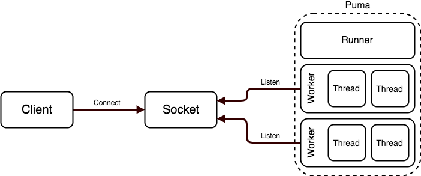
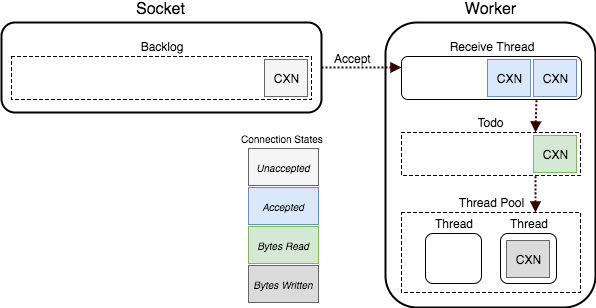
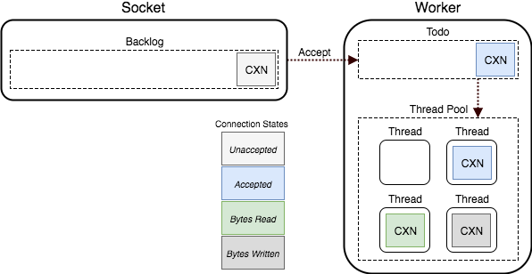

# Architecture

## Overview

Puma is a threaded web server, processing requests across a TCP or UNIX socket.

Workers accept connections from the socket and a thread in the worker's thread pool processes the client's request.

Clustered mode is shown/discussed here. Single mode is analogous to having a single worker process.

## Connection pipeline

* Upon startup, Puma listens on a TCP or UNIX socket.
  * The backlog of this socket is configured (with a default of 1024), determining how many established but unaccepted connections can exist concurrently.
  * This socket backlog is distinct from the "backlog" of work as reported by the control server stats. The latter is the number of connections in that worker's "todo" set waiting for a worker thread.
* By default, a single, separate thread is used to receive HTTP requests across the socket.
  * When at least one worker thread is available for work, a connection is accepted and placed in this request buffer
  * This thread waits for entire HTTP requests to be received over the connection
  * Once received, the connection is pushed into the "todo" set
* Worker threads pop work off the "todo" set for processing
  * The thread processes the request via the rack application (which generates the HTTP response)
  * The thread writes the response to the connection
  * Finally, the thread become available to process another connection in the "todo" set

### Disabling `queue_requests`

The `queue_requests` option is `true` by default, enabling the separate thread used to buffer requests as described above.

If set to `false`, this buffer will not be used for connections while waiting for the request to arrive.
In this mode, when a connection is accepted, it is added to the "todo" queue immediately, and a worker will syncronously do any waiting necessarry to read the HTTP request from the socket.